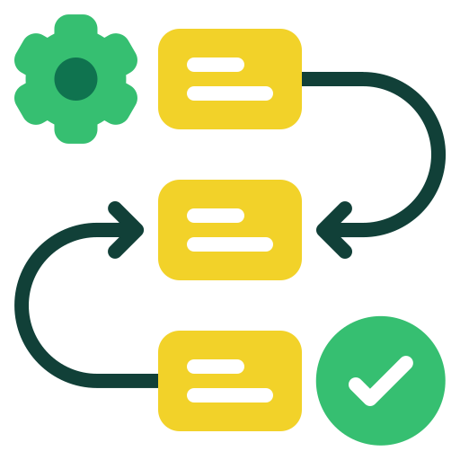
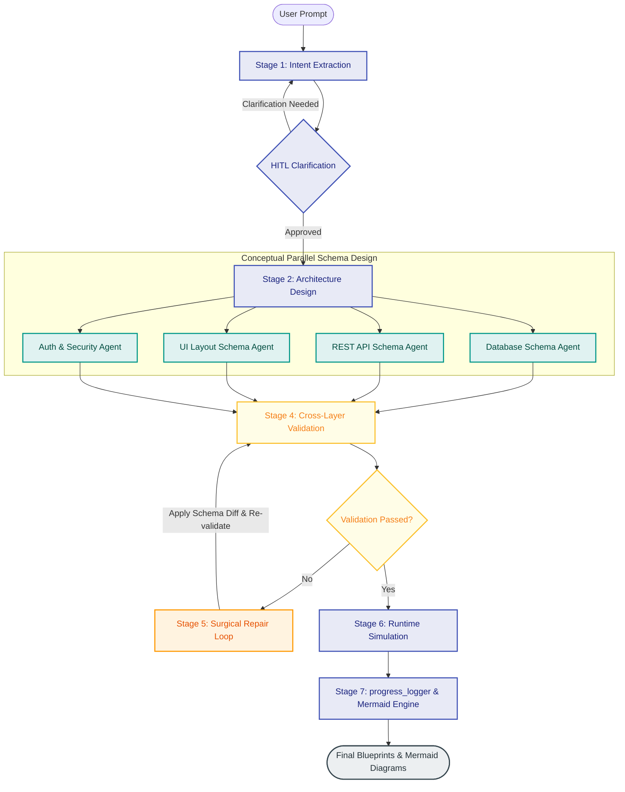

<p align="center">
  
  
  
  
</p>

<p align="center">
  
</p>

<h1 align="center">ProtoFlow</h1>
<p align="center"><b>Natural language descriptions to cross-validated, simulated, and production-ready application schemas.</b></p>

---

## Technical Overview

### What is ProtoFlow?
ProtoFlow is an autonomous, multi-agent AI compiler designed to translate natural language product ideas into high-fidelity, cross-validated system blueprints. By orchestrating a pipeline of specialized LLM-powered agents, ProtoFlow models database schemas, generates REST API specifications, designs user interfaces, establishes security models, and runs simulated operations to guarantee consistency across all architectural layers.

### What it does
Given a natural language input describing a software product:
> <samp>"Build a SaaS CRM containing contacts and deals, with role-based access control (Admin/Editor/Viewer) and a premium analytics plan gating certain views."</samp>

ProtoFlow compiles and delivers a unified, production-ready schema including:
* **Relational DB Schema:** Fully normalized SQL-ready schemas, relational mapping, primary/foreign key definitions, constraints, index placement, and automatic soft-delete mechanics.
* **REST API Contracts:** Full CRUD endpoints, path/query parameter structures, and request/response bodies mapped directly to DB entities.
* **UI Structure Layout:** Multi-page configurations, interactive components, input form validation definitions, and component-level visibility matrices.
* **Auth & Policy Matrices:** Granular Role-Based Access Control (RBAC) definitions, JWT security schemes, and resource restrictions.
* **Cross-Layer Validation Reports:** Comprehensive verification against structural integrity rules (e.g., matching database tables to endpoint routes and page permissions).
* **Runtime Transaction Simulation:** Proof-of-correctness logs simulating insert, update, and read commands across the compiled schemas.

### How it works
ProtoFlow compiles application schemas through a 10-stage execution pipeline running under an asynchronous supervisor. While the schema design tasks (Database, API, UI, and Auth) are conceptually fanned out in parallel, they are executed in a sequential queue with rate-limit dampening to handle the constraints of free-tier LLM endpoints.

---

## 🎯 Demo Task Requirements Mapping

This project was built to satisfy the **AI Engineer Demo Task** criteria.

| Demo Task Requirement | How ProtoFlow Solves It |
| :--- | :--- |
| **1. Multi-Stage Pipeline** | 10 distinct CrewAI stages (Intent → Architecture → DB/API/UI/Auth → Validation → Repair → Simulation). |
| **2. Strict Schema Enforcement** | `schemas/contracts.py` defines strict Pydantic models preventing hallucinations, nested deeply for consistency. |
| **3. Validation + Repair Engine** | `Validator Agent` diffs schemas for 12 hardcoded integrity rules. Failures trigger the `Repair Agent` to surgically patch JSON differences up to 3 times before escalating to HITL. |
| **4. Deterministic Behavior** | Forced JSON constraints, structured prompt variable injections, and zero-shot schema mappings. |
| **5. Execution Awareness** | `Runtime Validator` logically executes multi-step CRUD flows across the generated schemas to ensure end-to-end viability before returning the final object. |
| **6. Failure Handling (HITL)** | Built-in human-in-the-loop (HITL) system interrupts the pipeline if intent is `< 75%` confident, ambiguous, or if repair loops fail. |
| **7. Evaluation Framework** | `eval/prompts.json` contains exactly 10 real product prompts and 10 adversarial/edge cases to measure latency, repairs, and token usage via the `/eval/results` API. |

---

## Compiler Pipeline Architecture

The flowchart below demonstrates the execution path from initial prompt to final compiled blueprints, illustrating the parallel design process and the self-healing repair cycle.



> [!NOTE]
> **Rate-Limit Mitigation:** The backend runs the parallel synthesis stages sequentially using a safe task queue to guarantee stability against Groq's 12,000 TPM limit, while keeping execution asynchronous to prevent blocking the FastAPI server thread.

---

## Agent Roster & Specializations

ProtoFlow is powered by 10 specialized agent cards executing within the CrewAI framework:

| Agent Badge | Operational Domain & Responsibility |
| :--- | :--- |
|  | Parses input descriptions, calculates intent confidence, and pauses the pipeline for HITL input if specifications are sparse. |
|  | Lays down the core entity relations, system domains, and relational dependencies. |
|  | Builds highly detailed, normalized entity schemas complete with attributes, keys, and relational fields. |
|  | Maps database structures into REST-compliant API contracts, routing structures, and request parameters. |
|  | Generates frontend routing, page hierarchies, component layouts, and binds user inputs to API targets. |
|  | Defines role hierarchies, mapping operations to security policies and resource permission sets. |
|  | Compares the DB, API, UI, and Auth structures against 12 rules of referential integrity and security. |
|  | Reviews schema failures, generates surgical diffs, and patches target components to avoid schema drift. |
|  | Simulates operational logic (e.g., user creations, transaction inserts) to test consistency in execution. |
|  | Tracks compiler status metrics and generates Mermaid diagram representations of the compiled systems. |

---

## Core Engineering Features

### 1. Surgical Self-Healing Engine
If validation fails, the compiler does not restart. Instead, the `Repair Agent` computes a precise JSON structural diff (`SchemaDiffTool`) between validation iterations. It modifies only the conflicting fields, preventing LLM regression and reducing API token usage.

### 2. Event-Driven Asynchronous Server-Sent Events (SSE)
FastAPI publishes state updates, token usage metrics, agent logs, and HITL flags over a single SSE channel (`/stream/{session_id}`). The React client hooks directly into this stream to update the compiler graph in real-time.

### 3. LRU Prompt Cache & Intelligent Throttle
To work effectively within Groq free-tier constraints (1,000 RPM, 300,000 TPM), ProtoFlow uses a memory-based LRU response cache to bypass duplicate prompt calls and implements a configurable retry parser with backoff.

### 4. Zero-Downtime API Key Rotation & Model Fallback
When deploying large workloads, a single API key is often exhausted by Tokens-Per-Day (TPD) limits. ProtoFlow supports hot-loading multiple API keys from `.env` and automatically load-balances and rotates keys on rate-limit exhaustion. It also employs a mixed-model architecture, seamlessly falling back from 70B to 8B models (e.g. `gpt-oss-120b` or `llama-3.1-8b`) for context-heavy aggregation tasks to evade Tokens-Per-Minute (TPM) ceilings.

### 5. Built-in Evaluation & Benchmarking Harness
Contains a suite of **20 integration tests** covering:
* **10 Real-world Prompts:** E-commerce, multi-tenant SaaS, healthcare portals, etc.
* **10 Edge Cases:** Conflicting auth scopes, cyclic DB schemas, empty intents, and ambiguous instructions.
* Run tests with: `POST /eval/run/{id}` to automatically log latency, token footprints, and self-healing success metrics.

---

## Directory Anatomy

```
compiler/
├── src/compiler/
│   ├── config/
│   │   ├── agents.yaml            # Agent personality profiles & Groq parameters
│   │   └── tasks.yaml             # Tasks config with HITL & asynchronous settings
│   ├── eval/
│   │   ├── runner.py              # Evaluator router and test orchestrator
│   │   ├── recorder.py            # Records latency & validation rates to JSON
│   │   └── prompts.json           # 20 standard evaluation benchmarks
│   ├── schemas/
│   │   └── contracts.py           # Strictly typed Pydantic compiler models
│   ├── tools/
│   │   ├── json_repair_tool.py    # Parses JSON output blocks from LLM content
│   │   ├── schema_diff_tool.py    # Structural comparison tool for schema patches
│   │   ├── mermaid_generator_tool.py # Translates final schemas into Mermaid strings
│   │   └── llm_cache.py           # In-memory caching layer
│   ├── crew.py                    # Orchestrator with SSE emitting & repair loops
│   └── main.py                    # FastAPI entrypoint
├── frontend/
│   ├── src/
│   │   ├── pages/                 # HomePage, GeneratePage, ResultsPage
│   │   ├── components/            # StageCard, ProgressLogs, HITLModal
│   │   ├── hooks/                 # Custom SSE streaming hooks
│   │   └── api/                   # HTTP client endpoints
│   └── ...
├── .env.example
└── pyproject.toml
```

---

## Quick Start Guide

### Prerequisites
* **Python 3.10 – 3.13**
* **Node.js 18+**
* **uv** package manager installed (<kbd>pip install uv</kbd>)
* A free **Groq API key** from [console.groq.com](https://console.groq.com)

### 1. Initialize and Sync Backend
```bash
git clone https://github.com/Lokesh-916/ProtoFlow.git
cd ProtoFlow
uv sync
```

### 2. Establish Environment Keys
Create a `.env` file in the root directory. You can add multiple Groq keys to enable automatic load-balancing and bypass TPD limits!
```env
GROQ_API_KEY=your_primary_groq_key_here
GROQ_API_KEY_2=your_secondary_groq_key_here
GROQ_API_KEY_3=your_tertiary_groq_key_here
MAX_REPAIR_LOOPS=3
HITL_TIMEOUT_SECONDS=300
```

### 3. Setup UI Assets
```bash
cd frontend
npm install
cp .env.local.example .env.local
```

---

## Running the Compiler

Start the API backend and UI client in separate shell environments:

**Terminal 1 — API Backend:**
```bash
uv run uvicorn compiler.main:app --host 0.0.0.0 --port 8000 --reload
```

**Terminal 2 — React Client:**
```bash
cd frontend
npm run dev
```

Open your browser to <kbd>http://localhost:5173</kbd> to access the workspace.

---

## API & Communication Specifications

### Backend Routes

| Method | Endpoint | Description |
| :--- | :--- | :--- |
| `POST` | `/generate` | Accepts prompt, initializes compiler pipeline session. |
| `GET` | `/stream/{session_id}` | Streams compilation logs, schema states, and validation runs. |
| `POST` | `/clarify` | Resumes a compiler session paused by HITL prompts. |
| `GET` | `/result/{session_id}` | Returns final fully compiled JSON blueprint. |
| `GET` | `/eval/results` | Returns aggregated metrics and latency graphs. |

### SSE Event Schema

```json
{
  "event": "stage_update",
  "session_id": "session-xyz",
  "stage": "db_schema",
  "status": "complete",
  "model": "groq/llama-3.3-70b-versatile",
  "latency_ms": 1420,
  "output_summary": "{\"tables\": [...]}"
}
```

---

## Authors

* **Lokesh** — [@Lokesh-916](https://github.com/Lokesh-916)
